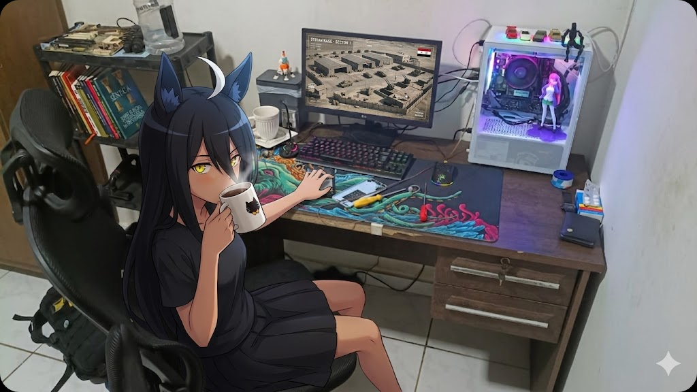

<h1 align="center">👋 Hey, I'm Miguel Sousa (Kona)</h1>

  

  

---

## 🚀 About Me

I'm a **Developer & Cybersecurity Enthusiast** focused on building and securing systems.

Currently studying **Internet Information Technology @ IMD/UFRN**,  
with a strong interest in **low-level programming, backend development, and offensive security**.

I like to understand how things work under the hood — from **APIs and databases** to **networks and system internals**.

---

## 🧠 What I Work With

- 💻 **Backend Development** (Node.js, APIs, databases)
- 🛡️ **Cybersecurity** (Pentesting, OSINT, Network Analysis)
- ⚙️ **Low-level & Systems** (C/C++, memory, performance)
- 🌐 **Web Development** (HTML, CSS, JavaScript)
- 🐧 **Linux Power User** (Debian, Fedora, Kali)

---

## 🛠️ Tech Stack

- Languages: **Python, C++, JavaScript, Bash, SQL**
- Tools: **Git, Docker (learning), Linux, Wireshark**
- Currently exploring: **Reverse Engineering, Networking, System Design**

---

## 📌 Current Focus

- Building real-world backend projects  
- Developing security-focused tools (ZeroSpecter 👀)  
- Improving architecture & clean code practices  
- Deepening knowledge in **networks and OS internals**

---

## 📫 Contact

- GitHub: https://github.com/Konazin  
- Email: m4caun4@gmail.com  
- Portfolio: https://konazin.github.io/

---

## 🧩 Philosophy

> "Good developers build systems. Great developers understand and secure them."
