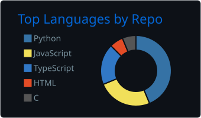

# Miguel Sousa — Kona

### Software Developer focused on backend systems

Building reliable APIs, business systems and complete applications.

 

---

## About me

I am a software developer focused on building backend systems, APIs and complete applications.

My main stack is based on **Java, Spring Boot and PostgreSQL**, with experience implementing authentication, role-based access control, business workflows, document handling, relational data models and REST APIs.

I also work with **Vue.js, TypeScript, React and React Native** when the product requires a web or mobile interface.

My background in software quality and application security helps me develop systems with validation, automated testing, permissions, failure scenarios and production behavior in mind.

I have technical training in **Web Development from IMD/UFRN** and practical experience working with real software requirements, testing, documentation and systems deployed in production environments.

---

## What I build

* Backend services and REST APIs
* Business systems and operational platforms
* Authentication and authorization flows
* Relational databases and business rules
* Web and mobile applications
* Automated tests and validation pipelines
* Containerized development environments
* Linux tools and system-level software

---

## Main stack

### Backend

### Frontend and mobile

### Data and infrastructure

### Quality and engineering

---

## Selected projects

<table>
<tr>
<td width="50%" valign="top">

### [Training App](https://github.com/Konazin/training-app)

Complete training management platform with a shared Java API, mobile applications and a web client for development and testing.

**Highlights**

* Java and Spring Boot backend
* REST API and relational persistence
* React Native and Expo applications
* Vue.js web interface
* Shared TypeScript packages
* Workout sessions and training history

`Java` `Spring Boot` `Vue.js` `React Native`

</td>

<td width="50%" valign="top">

### [Fenrir](https://github.com/Konazin/Fenrir)

Linux memory orchestration daemon designed around safe operations, bounded telemetry and rollback-first system behavior.

**Highlights**

* cgroups v2 integration
* Process and memory monitoring
* Recovery journals
* Concurrent runtime
* Tauri desktop interface
* Extensive validation and testing

`Rust` `Linux` `Tauri` `Vue.js`

</td>
</tr>

<tr>
<td width="50%" valign="top">

### [Mechanic Site](https://github.com/Konazin/Mechanic-Site)

Full-stack appointment management system for automotive workshops.

**Highlights**

* Authentication with JWT
* Appointment workflows
* Input validation
* Relational persistence
* Frontend and backend integration
* PostgreSQL production support

`Node.js` `Express` `PostgreSQL` `React`

</td>

<td width="50%" valign="top">

### [Site Requisite](https://github.com/Konazin/Site-Requisite)

Responsive institutional website developed from a professional visual identity specification.

**Highlights**

* Reusable React components
* Responsive interface
* Design tokens
* Component-scoped styles
* Production build
* Conversion-oriented sections

`React` `CSS Modules` `JavaScript`

</td>
</tr>
</table>

---

## Currently

* Building backend systems with Java and Spring Boot
* Improving software architecture and automated testing
* Practicing algorithms and data structures
* Developing complete products with web and mobile clients
* Studying software engineering and system design
* Expanding knowledge in CI/CD and observability

---

## GitHub activity

## GitHub activity

  

    

  

  

> GitHub language statistics represent repository file volume, not proficiency. Apparently even charts need disclaimers now.

---

## Contact

Open to opportunities as:

**Junior Software Developer · Java Backend Developer · Full Stack Developer**

 

 

**Software first. Backend by focus. Full stack when the product needs it.**

